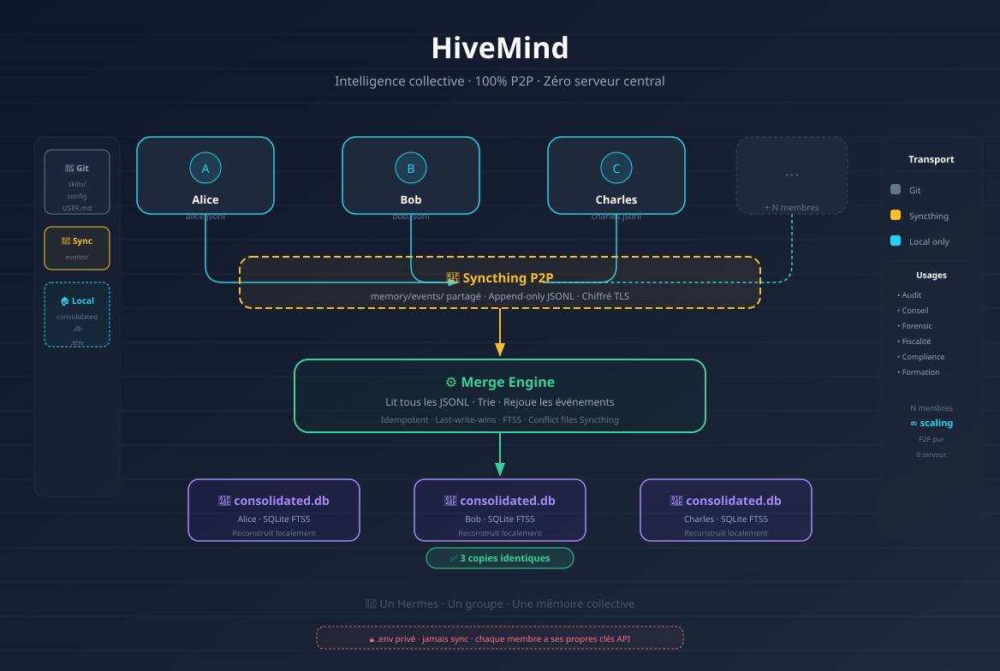

# HiveMind — Phase 1 : Intelligence Collective

<p align="center">
  
</p>

> Un Hermes partagé par un groupe. Pas un assistant individuel — une intelligence collective.



## Architecture

```
┌─────────────────────────────────────────────────────────────┐
│   ~/.hermes/profiles/<org>/                                  │
│   ├── skills/          ← Git (push/pull)                    │
│   ├── config.yaml      ← Git                                │
│   ├── USER.md          ← Git                                │
│   ├── memory/                                               │
│   │   ├── events/       ← Syncthing (JSONL append-only)     │
│   │   └── consolidated.db ← Local (reconstruit par merge)   │
│   ├── .env             ← JAMAIS sync                        │
│   └── .gitignore                                             │
└─────────────────────────────────────────────────────────────┘
```

**Transport :**
- Git → skills, config, USER.md (asynchrone, versionné)
- Syncthing → memory/events/ (P2P, temps quasi-réel)
- Local → consolidated.db (reconstruit, jamais sync)

## Composants

| Module | Rôle |
|---|---|
| `merge_engine.py` | Lit tous les JSONL, rejoue chronologiquement, produit consolidated.db |
| `hivemind_mnemosyne.py` | Pont Mnemosyne ↔ Event Log (remember, recall, bootstrap) |
| `hivemind_cli.py` | CLI d'onboarding (init, join, status, serve) |
| `watcher.py` | Surveille events/, déclenche merge automatique |
| `event_writer.py` | Écriture manuelle d'événements |
| `hivemind_common.py` | Helpers partagés |

## Installation

```bash
# Cloner
git clone https://github.com/rtsitola/hivemind.git
cd hivemind
export PYTHONPATH=$(pwd)

# Créer un HiveMind
python3 -m hivemind.hivemind_cli init mon-cabinet

# Configurer Syncthing (voir instructions affichées)
# Éditer ~/.hermes/profiles/mon-cabinet/.env

# Démarrer le watcher
python3 -m hivemind.hivemind_cli serve mon-cabinet
```

> 📖 **Nouveau membre ?** Lis [ONBOARDING.md](../ONBOARDING.md) — guide complet étape par étape.

## Usage

```bash
# Écrire une mémoire
python3 -m hivemind.hivemind_mnemosyne --agent alice remember "Client Omega : vérifier cash-flow"

# Merger les événements
python3 -m hivemind.hivemind_mnemosyne merge

# Rechercher (FTS5)
python3 -m hivemind.hivemind_mnemosyne recall "cash-flow"

# Bootstrap depuis Mnemosyne existante
python3 -m hivemind.hivemind_mnemosyne --agent alice bootstrap

# Status
python3 -m hivemind.hivemind_cli status
```

## Format Event Log

```jsonl
{"op":"remember","id":"evt-001","agent":"alice","ts":"2026-05-26T12:00:00Z",
 "payload":{"content":"Client Omega : demander cash-flow avant audit",
            "importance":0.8,"source":"correction","scope":"shared"}}

{"op":"update","id":"evt-002","agent":"bob","ts":"2026-05-26T12:05:00Z",
 "payload":{"memory_id":"mem-abc","content":"Mise à jour...","importance":0.9}}

{"op":"forget","id":"evt-003","agent":"alice","ts":"2026-05-26T12:10:00Z",
 "payload":{"memory_id":"mem-abc"}}
```

## Résolution de conflits

| Conflit | Résolution |
|---|---|
| Même event.id rejoué | Idempotent (processed_events) |
| remember + forget même mémoire | Last-write-wins (ts) |
| Deux update concurrents | Last-write-wins (ts) |
| remember même contenu, sources différentes | Fusion (sources combinées) |

## Tests

```bash
cd hivemind/tests
PYTHONPATH=$(dirname $(pwd)):$PYTHONPATH python3 test_e2e.py
PYTHONPATH=$(dirname $(pwd)):$PYTHONPATH python3 test_integration.py
PYTHONPATH=$(dirname $(pwd)):$PYTHONPATH python3 test_watcher.py
PYTHONPATH=$(dirname $(pwd)):$PYTHONPATH python3 test_cli.py
```

## FTS5

La recherche full-text utilise SQLite FTS5. L'index est automatiquement maintenu par des triggers. Le merge engine fait un `rebuild` idempotent à chaque cycle pour garantir la cohérence.

```sql
-- Requête FTS5
SELECT m.* FROM memories m
JOIN memories_fts fts ON m.rowid = fts.rowid
WHERE memories_fts MATCH 'fraude OR circularisation'
ORDER BY m.importance DESC;
```

## Phase 2 : Clustered HiveMind

Pour les organisations multi-équipes, voir le repo **hivemind-cluster** :
https://github.com/rtsitola/hivemind-cluster

Cluster Weights, pondération, export engine, redistribution — tout est dans le repo séparé.
`pip install hivemind` puis `pip install hivemind-cluster`.

## Étape suivante

Déploiement réel → voir `../ONBOARDING.md`
